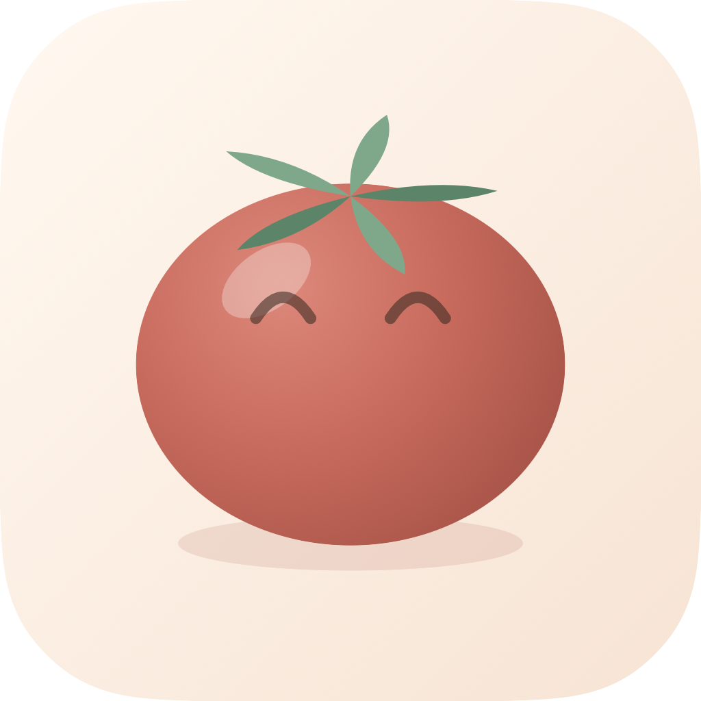
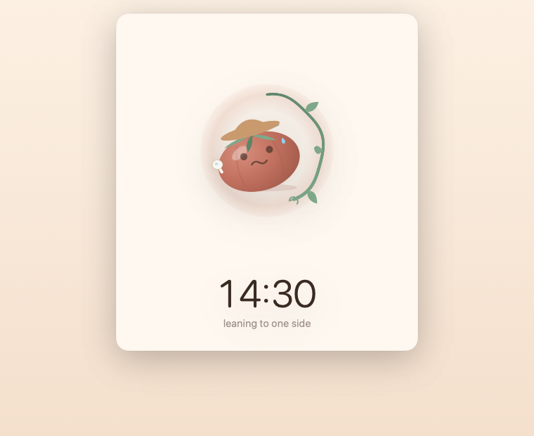
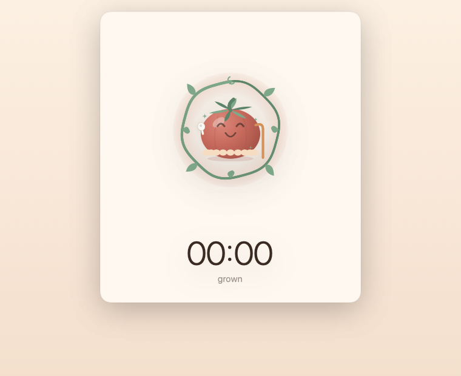

# 🍅 PostureTomato

### You focused for an hour. Your neck paid for it.

**Keep both.** The earbuds already in your ears can tell you when one is costing the other — so you finish the day focused *and* upright.

**[→ posturetomato website](https://moecui22.github.io/posturetomato/)** · macOS 14+ · Free · No account, no tracking

---

## 🌱 The better your focus, the worse your posture

Every deep hour at a desk is spent slowly folding forward, and you only find out when your neck tells you — long after you could have done anything about it. Focus and posture pull against each other, and until now you could only really have one.

**It copies your head.** Lean and it leans. Slump and it slumps with you. Watching a little tomato mimic you is stupidly delightful the first time — and the tenth. Somehow it also fixes your posture.

**Sit well and it ripens.** Hold yourself and the fruit deepens to a rich red. Slouch and it stays pale and green. You'll catch yourself straightening up for no reason other than wanting a nicer tomato. That's the point.

**It never interrupts.** No alarms. No pop-ups. No nagging. Your tomato quietly loses its colour, and you glance up when you feel like it.

Finish a session and it's harvested into a crate you can flip back through. 🥫 Quit halfway and it's squashed into ketchup. You won't want the ketchup.

## ✨ Features

| | |
|---|---|
| 🎧 | Your AirPods become a posture sensor — nothing new to buy |
| 🪞 | A tomato that mimics your head in real time |
| 🎯 | Sit however *you* like; that becomes the mark |
| 🌿 | Never interrupts — the fruit just quietly loses its colour |
| ⏱️ | A proper focus timer, lengths you choose |
| 📦 | Crates of finished sessions to flip back through |
| 🔔 | Japanese temple bells, synthesised on the fly — no audio files |
| 👒 | Tomatoes with hats, glasses and shoes, because why not |

## 🎧 Requirements

macOS 14 or later. Posture tracking needs **AirPods (3rd gen), AirPods Pro, AirPods Max, or Beats Fit Pro**.

Only one earbud in? That works — the app reports which ear it's reading and draws just that bud.

**No AirPods?** The timer, crates, drawer and sounds all work fine. You only lose the posture half.

## 🔒 Privacy

Motion data never leaves your Mac. No account, no analytics, **no networking code at all** — the binary links no networking frameworks and holds no network entitlement. Sessions live in local `UserDefaults`.

[Privacy policy](https://moecui22.github.io/posturetomato/privacy.html)

## 🔬 Notes on `CMHeadphoneMotionManager`

Things measured while building this, in case they save someone else the trouble:

- **Sample rate is 50 Hz**, not the 25 Hz widely repeated online.
- **Resting pitch sits around −39°**, not zero — the sensor is in your ear, not on the crown of your head. Calibration isn't a nicety, it's mandatory.
- **There's no magnetometer**, so yaw drifts and can't be trusted over a session. Pitch and roll are the usable channels.
- **Nothing tells you a bud came out.** There's no notification for it — you detect removal by watching for the stream to go silent.
- `sensorLocation` is annotated iOS-only in the macOS SDK but works anyway; read it via KVC.

## 🍅 A note on honesty

It won't tell you your posture is **correct** — nothing in your ear can see your spine, and any app promising that is selling you something.

What it does is remember how you sat when you were comfortable, and let you know, kindly, when you've wandered off. That turns out to be all most of us needed.

---

© 2026 Eric Cui · [Website](https://moecui22.github.io/posturetomato/) · [Privacy](https://moecui22.github.io/posturetomato/privacy.html)

